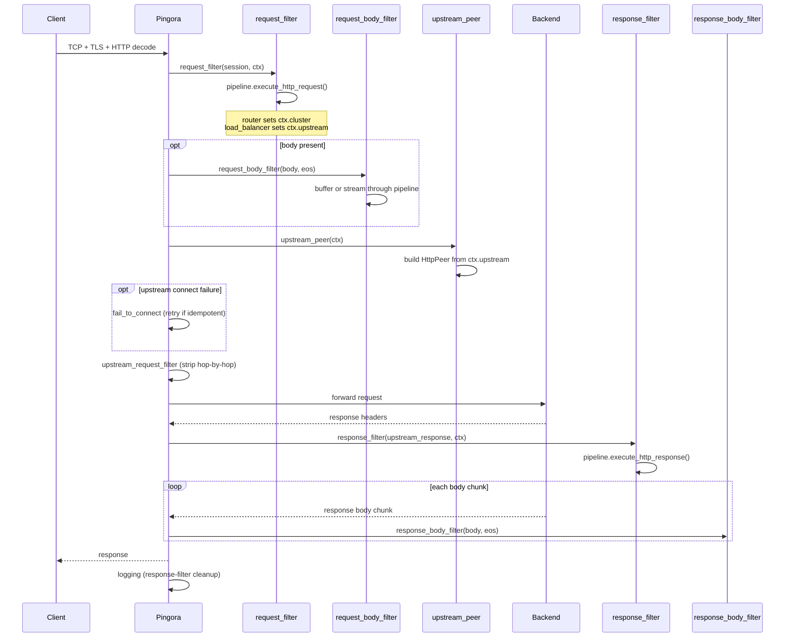

# Connection Lifecycle

## HTTP Connection Lifecycle

1. TCP accept, TLS handshake, HTTP decode (Pingora)
2. `request_filter`: pipeline runs filters in order; router
   sets `ctx.cluster`, load balancer sets `ctx.upstream`
3. `request_body_filter`: buffer or stream body chunks
   through filters (if any filter declares body access)
4. `upstream_peer`: converts `ctx.upstream` to `HttpPeer`
5. Connect to upstream; `fail_to_connect` retries
   idempotent requests on failure
6. `upstream_request_filter`: strips hop-by-hop headers
7. Request forwarded, response headers received
8. `response_filter`: pipeline runs filters in reverse
9. `response_body_filter`: stream response body through
   filters (synchronous; Pingora constraint)
10. `logging`: re-runs response filters if response
    phase was skipped (upstream error, filter rejection)
11. Connection returned to pool

## TCP Connection Lifecycle

1. TCP accept, optional TLS handshake
2. `on_connect` : TCP filters run in order
3. Bidirectional byte forwarding to upstream
4. `on_disconnect` : TCP filters run on close

## Related

- [Architecture Overview](overview.md)
- [Payload Processing](payload-processing.md)
- [HTTP Correctness](http-correctness.md)
